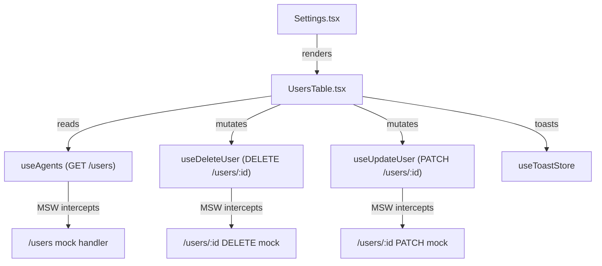

# Design Document: settings-users-table

## Overview

This feature extracts the inline users table from `src/pages/Settings.tsx` into a dedicated `src/components/UsersTable.tsx` component, while simultaneously fixing two UI bugs, wiring up missing mutations (delete, suspend/activate), adding missing data fields (avatar, phone, last login, user type), and updating the MSW mock handlers to match the spec-compliant `/users` endpoint.

The work is purely a refactor + feature-completion pass — no new API endpoints are introduced. The component consumes the existing `useAgents` infinite-query hook, `useDeleteUser`, and `useUpdateUser` hooks, and surfaces feedback via the existing `useToastStore`.

---

## Architecture



`Settings.tsx` owns the query state (`agentQuery`, `selectedOrgId`) and the `useAgents` call. It passes the result and callbacks down to `UsersTable` as props. `UsersTable` owns all internal UI state: expanded rows, action menu open/close, delete confirmation state.

---

## Components and Interfaces

### `UsersTable` props interface

```ts
export interface UsersTableProps {
  /** Paginated agents data from useAgents */
  agentsQuery: ReturnType<typeof useAgents>;
  /** Whether the roles query is still loading (used for combined loading state) */
  rolesLoading: boolean;
  /** Current query state (for display / filter awareness) */
  agentQuery: AgentQuery;
}
```

`Settings.tsx` passes `agentsQuery` (the full query object, not just `.data`) so `UsersTable` can call `fetchNextPage` and read `hasNextPage` / `isFetchingNextPage` itself.

### Internal state owned by `UsersTable`

| State | Type | Purpose |
|---|---|---|
| `expandedRows` | `Set<string>` | Tracks which row IDs are expanded |
| `actionMenuOpen` | `string \| null` | ID of the row whose action menu is open |
| `pendingDelete` | `string \| null` | ID of the row in "Confirm Delete?" state |
| `menuRef` | `RefObject<HTMLDivElement>` | Ref attached to the currently-open menu container for outside-click detection |

### Avatar sub-component (inline)

A small inline helper renders the avatar circle. It tries `` first; on `onError` it falls back to initials. Both desktop (40 × 40 px) and mobile (48 × 48 px) sizes are passed as a prop.

---

## Data Models

### `Agent` (extended)

The existing `Agent` interface in `useAgent.ts` is used as-is by `useAgents`. The `useAgents` mapping already includes `avatarPath` and `lastLoginAt`. The only missing field is `userType`, which must be added to the mapping:

```ts
// In useAgents.ts — add to the mapped object:
userType: user.user_type as 'passenger' | 'staff' | undefined,
```

The `Agent` interface in `useAgent.ts` does not need to change for this feature because `UsersTable` receives the mapped objects from `useAgents` (which returns `any[]` cast to `Agent[]`). The `userType` field will be present at runtime even if the static type doesn't declare it yet. Optionally, the `Agent` interface can be extended:

```ts
export interface Agent {
  // ... existing fields ...
  avatarPath?: string | null;
  lastLoginAt?: string | null;
  userType?: 'passenger' | 'staff';
}
```

### MSW mock user shape (`UserListItem`)

```ts
interface MockUser {
  id: string;
  first_name: string;
  last_name: string;
  email: string;
  phone_number: string | null;
  avatar_path: string | null;
  user_type: 'staff' | 'passenger';
  status: 'active' | 'suspended' | 'pending_verification';
  roles: string[];
  org_id: string;
  last_login_at: string | null;
  created_at: string;
}
```

The mock array is declared as `let mockUsers: MockUser[]` so DELETE and PATCH handlers can mutate it in-memory.

### Paginated response shape

```ts
interface PaginatedResponse<T> {
  data: T[];
  total: number;
  page: number;
  limit: number;
}
```

---

## Correctness Properties

*A property is a characteristic or behavior that should hold true across all valid executions of a system — essentially, a formal statement about what the system should do. Properties serve as the bridge between human-readable specifications and machine-verifiable correctness guarantees.*

### Property 1: Avatar URL construction

*For any* non-empty `avatarPath` string on an Agent, the `src` attribute of the rendered avatar `` element SHALL equal `CDN_BASE_URL + "/" + avatarPath`.

**Validates: Requirements 4.1**

### Property 2: Initials fallback

*For any* Agent with a null or empty `avatarPath`, the displayed initials SHALL equal `firstName[0] + lastName[0]` (uppercased first characters of the name fields).

**Validates: Requirements 4.3**

### Property 3: Delete confirmation calls hook with correct userId

*For any* user row in the table, clicking "Delete User" then "Confirm Delete?" SHALL invoke `useDeleteUser` with exactly that row's `userId` and no other.

**Validates: Requirements 5.3**

### Property 4: Action menu status options are mutually exclusive and status-driven

*For any* user row, the action menu SHALL display exactly the option that corresponds to the user's current status: "Suspend User" when `status === "active"`, "Activate User" when `status === "suspended"`, and neither option when `status === "pending_verification"`.

**Validates: Requirements 6.1, 6.2, 6.3**

### Property 5: Suspend/activate calls hook with correct payload

*For any* user row, clicking the suspend/activate option SHALL invoke `useUpdateUser` with `{ status: "suspended" }` for active users and `{ status: "active" }` for suspended users.

**Validates: Requirements 6.4, 6.5**

### Property 6: userType mapping round-trip

*For any* API response object with a `user_type` field, the `Agent` object produced by `useAgents` SHALL have a `userType` field equal to the original `user_type` value.

**Validates: Requirements 7.1**

### Property 7: lastLoginAt formatting

*For any* non-null ISO 8601 date string as `lastLoginAt`, the text rendered in the expanded row SHALL be a human-readable date string (parseable by `new Date()`) and SHALL NOT be the raw ISO string.

**Validates: Requirements 7.3**

### Property 8: Mock pagination correctness

*For any* `page` and `limit` query parameters sent to `GET /users`, the returned `data` array SHALL equal the slice `mockUsers.slice((page - 1) * limit, page * limit)` of the unfiltered (or filtered) mock dataset.

**Validates: Requirements 8.3**

### Property 9: Mock status filter correctness

*For any* `status` query parameter sent to `GET /users`, every item in the returned `data` array SHALL have `status` equal to the filter value.

**Validates: Requirements 8.4**

### Property 10: Mock user_type filter correctness

*For any* `user_type` query parameter sent to `GET /users`, every item in the returned `data` array SHALL have `user_type` equal to the filter value.

**Validates: Requirements 8.5**

### Property 11: Mock DELETE removes user

*For any* `userId` present in the mock dataset, after a successful `DELETE /users/:id` request, a subsequent `GET /users` SHALL not contain a user with that `id`.

**Validates: Requirements 9.1**

### Property 12: Mock PATCH updates user fields

*For any* `userId` present in the mock dataset and any valid partial update payload, the object returned by `PATCH /users/:id` SHALL have all fields from the original user merged with the update payload (update fields take precedence).

**Validates: Requirements 9.2**

---

## Error Handling

| Scenario | Handling |
|---|---|
| `useDeleteUser` mutation error | Catch in `onError`, call `showToast(error.message, "error")` |
| `useUpdateUser` mutation error | Catch in `onError`, call `showToast(error.message, "error")` |
| Avatar `` load failure | `onError` handler sets local `imgError` state → renders initials fallback |
| `avatarPath` is null/empty | Skip `` entirely, render initials circle directly |
| `lastLoginAt` is null | Render the string `"Never"` |
| `phoneNumber` is null/empty | Omit the phone row from expanded details |
| Mock DELETE/PATCH with unknown id | Return `HttpResponse.json({ message: "Not found" }, { status: 404 })` |
| Empty users list | Render the existing empty-state illustration with "No users found" message |

---

## Testing Strategy

### Unit / example-based tests

These cover specific interactions and edge cases that are not universal properties:

- Toggle behavior: clicking the 3-dot button twice closes the menu (Req 2.2)
- Outside-click: mousedown outside the menu container closes it (Req 2.3)
- Inside-click: mousedown inside the menu container keeps it open (Req 2.5)
- Delete confirmation label change: first click shows "Confirm Delete?", menu close resets to "Delete User" (Req 5.2, 5.5)
- Delete mutation error shows toast (Req 5.6)
- Status mutation success closes menu (Req 6.6)
- Status mutation error shows toast (Req 6.7)
- `lastLoginAt` null renders "Never" (Req 7.4)
- Avatar `onError` falls back to initials (Req 4.2)
- Mock 404 for unknown id on DELETE and PATCH (Req 9.3)

### Property-based tests

PBT is appropriate here because several behaviors are universal across all inputs (avatar URL construction, initials derivation, status-driven menu options, data mapping, mock filtering/pagination). The project uses TypeScript/React, so **fast-check** is the recommended PBT library.

Each property test runs a minimum of **100 iterations**.

Tag format: `// Feature: settings-users-table, Property N: <property text>`

| Property | fast-check arbitraries |
|---|---|
| P1 Avatar URL | `fc.string({ minLength: 1 })` for avatarPath |
| P2 Initials fallback | `fc.string({ minLength: 1 })` for firstName, lastName |
| P3 Delete calls hook | `fc.record({ userId: fc.uuid(), ... })` for a user row |
| P4 Status menu options | `fc.constantFrom('active', 'suspended', 'pending_verification')` |
| P5 Suspend/activate payload | `fc.constantFrom('active', 'suspended')` for status |
| P6 userType mapping | `fc.constantFrom('staff', 'passenger')` for user_type |
| P7 lastLoginAt formatting | `fc.date()` mapped to ISO string |
| P8 Pagination | `fc.integer({ min: 1 })` for page, `fc.integer({ min: 1, max: 50 })` for limit |
| P9 Status filter | `fc.constantFrom('active', 'suspended', 'pending_verification')` |
| P10 user_type filter | `fc.constantFrom('staff', 'passenger')` |
| P11 DELETE removes user | `fc.uuid()` for userId, seeded into mock array |
| P12 PATCH merges fields | `fc.record({ status: fc.constantFrom('active', 'suspended') })` as patch payload |

### Smoke / structural checks

- `UsersTable.tsx` file exists and exports a named `UsersTableProps` interface (Req 1.1, 1.4)
- `Settings.tsx` no longer contains inline table markup (Req 1.3)
- Legacy `/organizations/:orgId/agents` handlers still present in `agents.ts` (Req 8.6)
- Mock dataset contains ≥ 5 records with varied statuses and user types (Req 8.7)
